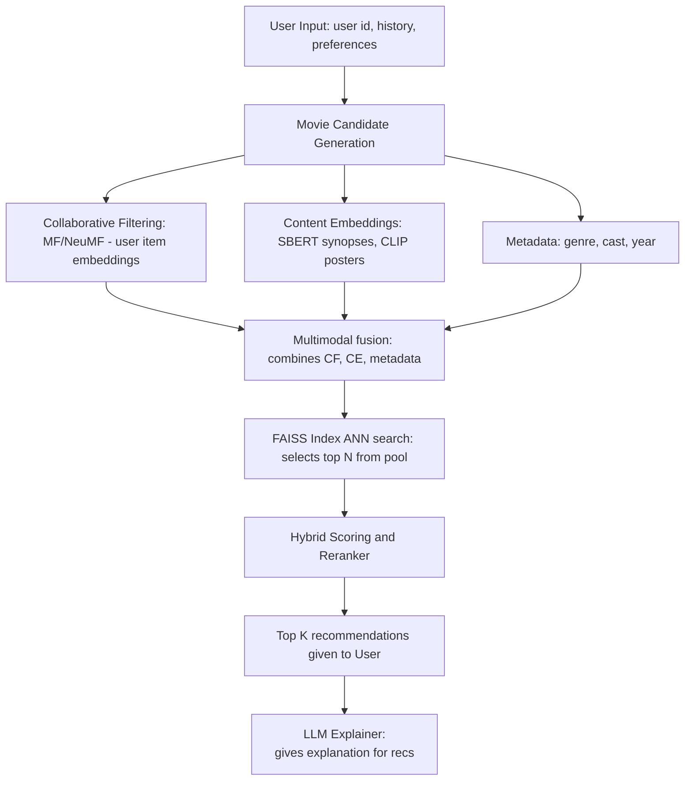

```mermaid
flowchart TD
  UI[User Input: user id, history, preferences]
  UI --> CG[Movie Candidate Generation]

  CF[Collaborative Filtering: MF/NeuMF - user item embeddings]
  CE[Content Embeddings: SBERT synopses, CLIP posters]
  META[Metadata: genre, cast, year]
 
  CG --> CF
  CG --> CE
  CG --> META

  CF --> AGG
  CE --> AGG
  META --> AGG

  AGG[Multimodal fusion: combines CF, CE, metadata]

  AGG --> FAISS[FAISS Index ANN search: selects top N from pool]

  FAISS --> RERANK[Hybrid Scoring and Reranker]

  RERANK --> TOPK[Top K recommendations given to User]

  TOPK --> EXPLAINER[LLM Explainer:
   gives explanation for recs]
```